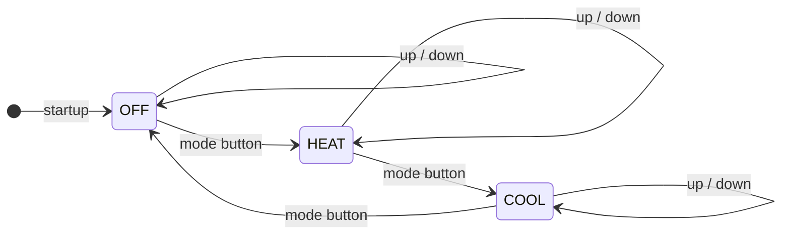
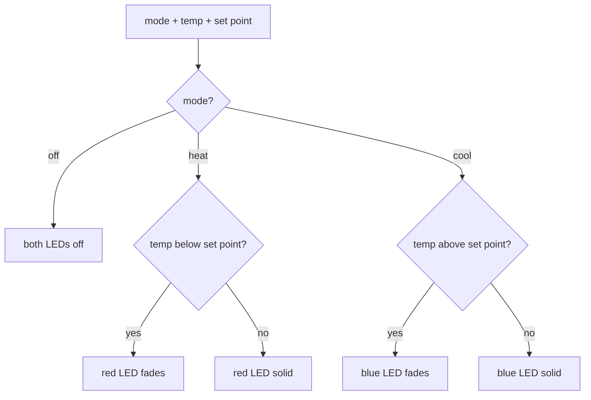
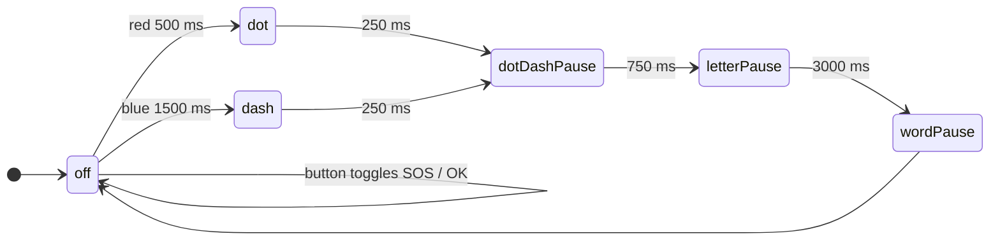

# CS-350 Module Eight Journal

**Justin Guida**
CS-350-14294-M01 | Emerging Systems Architectures & Technologies | 2026 C-3 (May – Jun)
Southern New Hampshire University

## Artifacts

| # | Artifact | Deliverable | Folder |
|---|----------|-------------|--------|
| 1 | Morse Code Button/LED State Machine | 5-1 Milestone Three: Input With Buttons Lab | [`artifacts/01-milestone-three-buttons-lab/`](artifacts/01-milestone-three-buttons-lab/) |
| 2 | Raspberry Pi Smart Thermostat | 7-1 Final Project | [`artifacts/02-thermostat-final-project/`](artifacts/02-thermostat-final-project/) |

## What the projects were

The buttons lab was about driving real hardware from code on a Raspberry Pi. The board blinks a red
and blue LED to send a message in Morse code, prints status to a 16x2 LCD, and switches the message
between SOS and OK when you press a button. The actual lesson was modeling timed behavior as a state
machine (`off → dot → dash → pauses`) and getting the timing right (500 ms dots, 1500 ms dashes, and
the gaps in between) while still reacting to a button press on a separate thread.

The final project was a smart thermostat, which is basically a small connected product. It reads
temperature from an AHT20 sensor over I2C, cycles through OFF / HEAT / COOL with three buttons, shows
state on the LCD, fades red/blue PWM LEDs depending on how far the temperature is from the set point,
and ships a `state,temp,setpoint` message out over UART so a server could read it. Take in sensor
data, run it through a control loop, output something for both a human and a machine.

## State machines

Both artifacts are state machines at heart, so here's what each one actually does.

**Thermostat (final project).** The mode button cycles OFF → HEAT → COOL → OFF, and the up/down
buttons nudge the set point in any mode without changing which mode you're in.

Inside HEAT and COOL the LEDs react to how far the current temperature is from the set point:

**Buttons lab (Milestone Three).** A Morse machine that walks symbol by symbol and toggles the
message between SOS and OK when the button is pressed.

## What went well

The thing I'm happiest with is that I kept the thermostat's decision-making separate from the
hardware. All the logic lives in `controller.py` as small functions over a frozen `ThermostatState`
dataclass, so it never touches a GPIO pin directly. That meant I could actually unit test it on my
laptop with no Pi plugged in, which is the kind of setup I lean on in my own CI/CD work anyway, where
the goal is to catch problems before anything ships. On the buttons lab I'm happy with the timing,
the dot/dash/letter/word pauses came out clean and the button stayed responsive because the Morse
output runs on its own thread.

## What I'd improve

The Milestone Three code creates its LEDs, LCD, and pins at the top of the class, so it assumes the
real board is there and is harder to test than the thermostat ended up being. If I went back I'd do
what the final project taught me and hide the hardware behind a thin layer so the logic stays pure
and testable. I'd also handle flaky I2C reads better and swap some of the `sleep` timing for a real
scheduler so a long transmission doesn't drift.

## Tools and resources I'm keeping

`gpiozero`, `python-statemachine`, and the Adafruit/Blinka stack for talking to GPIO, I2C, and the
LCD. Sketching the state machine first (Mermaid diagram plus a short design doc in `docs/`) before
writing code, since it caught edge cases early. And running `unittest` and `compileall` as a quick
gate before every commit. That last habit lines up directly with the CI/CD tooling I build on my own
time, so it's something I'll keep using outside class.

## Transferable skills

The big one is modeling a problem as a state machine and keeping the "what to do" separate from the
"how to do it." That split plus testing the logic layer applies to almost anything, not just
embedded work. Most of my projects outside class are some mix of CI/CD tooling and AI governance, and
both of those come back to the same idea: a deterministic core you can actually verify is way easier
to trust than logic tangled up with side effects, and it's way easier to wrap a pipeline around. The
thermostat is a small example of that, but it's the same instinct I bring to the bigger stuff I build.
I'm also taking away comfort with I2C, UART, and GPIO/PWM, which carries over to IoT and robotics.

## Maintainable, readable, adaptable

The thermostat is split into real modules by job: `config.py` (pins, timing, UART), `controller.py`
(logic), `hardware.py` (device adapters), `uart.py` (messaging), and `app.py` (the loop). Because
the pins and timing live in `config.py`, you can rewire or retune the board without touching the
logic, and swapping the sensor or display is a one-module change. Type hints, an immutable state
object, and the state diagram keep it readable, and the original `Thermostat.py` still works as an
entry point even after I refactored it into a package.
