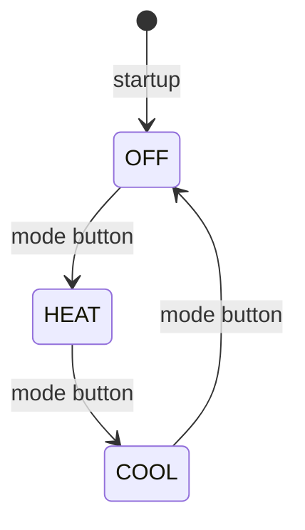

# CS-350 Smart Thermostat State Machine

Source PDF: [CS350_Thermostat_State_Machine.pdf](CS350_Thermostat_State_Machine.pdf)

## Overview

The thermostat starts by initializing I2C, GPIO, UART, the LCD, buttons, and LEDs. After startup, it enters `OFF` mode. The mode button cycles through `OFF`, `HEAT`, and `COOL`. The set point buttons adjust the target temperature in all modes.

## Modes

| Mode | LED behavior | UART output | LCD output |
| --- | --- | --- | --- |
| `OFF` | Red LED off; blue LED off | `off,temp,setpoint` | Date/time plus temperature or set point |
| `HEAT` | If current temperature is below set point, red LED fades; otherwise red LED is solid | `heat,temp,setpoint` | Date/time plus temperature or set point |
| `COOL` | If current temperature is above set point, blue LED fades; otherwise blue LED is solid | `cool,temp,setpoint` | Date/time plus temperature or set point |

## Controls

| Control | Behavior |
| --- | --- |
| Red mode button | Cycles `OFF -> HEAT -> COOL -> OFF` |
| Green up button | Increases the set point by 1 degree |
| Blue down button | Decreases the set point by 1 degree |

## Hardware Behavior

The AHT20 sensor supplies the current temperature through I2C. GPIO and PWM control the red and blue LEDs. UART sends a comma-delimited state, current temperature, and set point message to simulate server communication.
